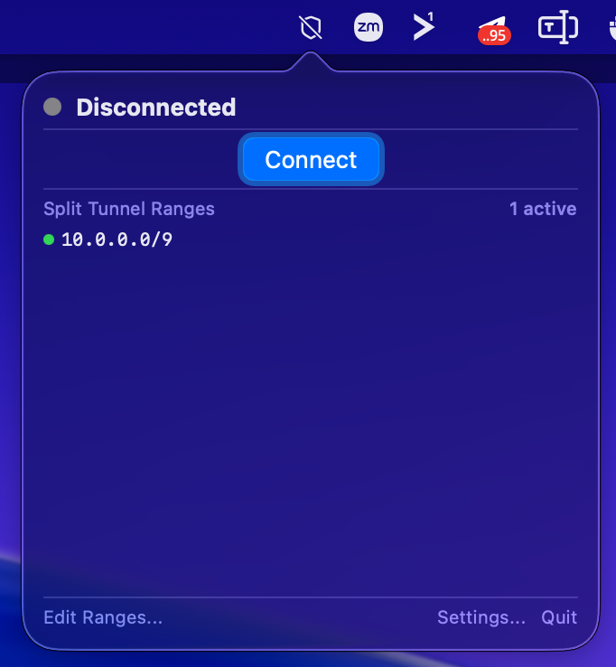
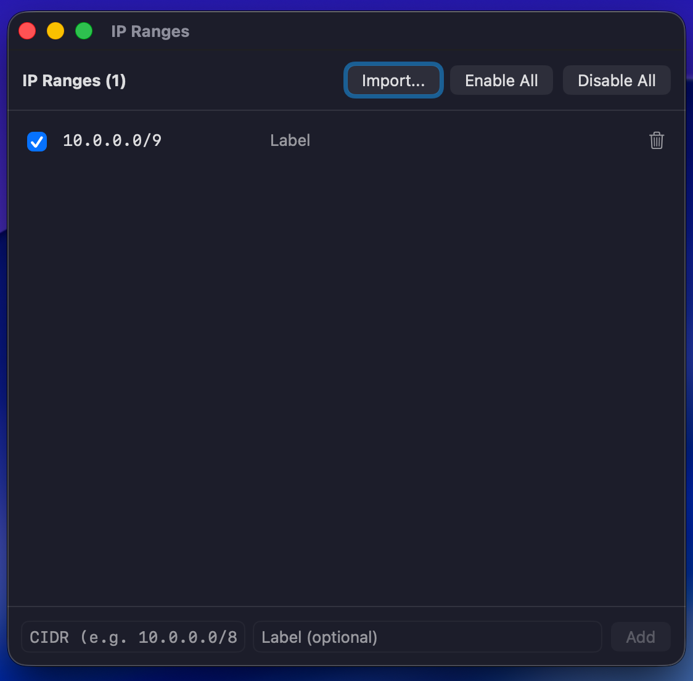
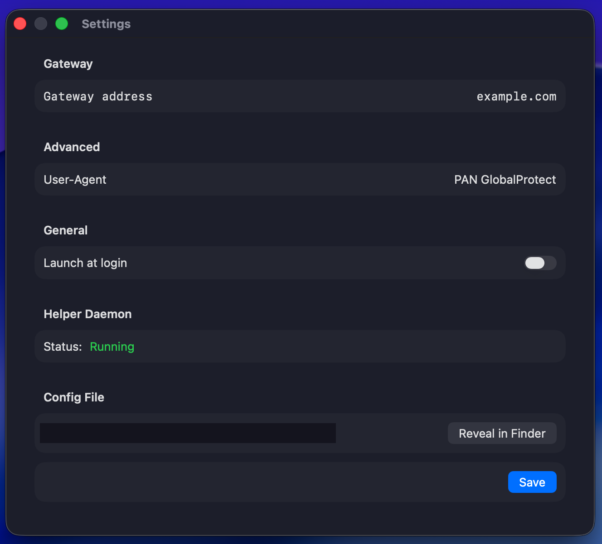

gp-saml-gui
===========

Table of Contents
=================

  * [Introduction](#introduction)
  * [GPConnect: native macOS menu bar app](#gpconnect-native-macos-menu-bar-app)
    * [Screenshots](#screenshots)
    * [Features](#features)
    * [GPConnect requirements](#gpconnect-requirements)
    * [Download a release](#download-a-release)
    * [Build from source](#build-from-source)
    * [Install GPConnect](#install-gpconnect)
    * [Usage](#usage)
    * [Configuration](#configuration)
    * [Known limitations](#known-limitations)
  * [Installation](#installation)
    * [First, non-Python Dependencies](#first-non-python-dependencies)
    * [Second, gp-saml-gui itself](#second-gp-saml-gui-itself)
  * [How to use](#how-to-use)
    * [Extra arguments to OpenConnect](#extra-arguments-to-openconnect)
  * [macOS: Privileged Helper (no sudo prompts)](#macos-privileged-helper-no-sudo-prompts)
  * [License](#license)

Introduction
============

The main goal of this repo is to make **split tunneling** easy on GlobalProtect VPNs that require
[SAML](https://en.wikipedia.org/wiki/Security_Assertion_Markup_Language) single-sign-on (SSO) — routing only
specific subnets over the VPN via OpenConnect's `vpn-slice`, instead of sending all your traffic through it.
SAML logins can't be scripted the way username/password logins can, so this repo handles that step for you,
then connects with [OpenConnect](https://www.infradead.org/openconnect). (The GlobalProtect protocol is
supported in OpenConnect v8.0 or newer; v8.06+ is recommended.) It provides three pieces that work together:

- **`gp-saml-gui`** — a cross-platform Python script that drives the SAML login in a webview and hands the
  resulting session to `openconnect`
- **GPConnect** — a native macOS menu bar app and **`gpconnect`** CLI wrapping the same flow, with
  connect/disconnect status and an editable list of split-tunnel IP ranges (see below)
- **A privileged helper daemon** (macOS) so either of the above can start `openconnect` as root without
  repeated `sudo` prompts

This is known to work with many GlobalProtect VPNs using the major single-sign-on (SSO) providers:

- Okta (sign-in URLs typically `https://<company>.okta.com/login/*`)
- Microsoft (sign-in URLs typically `https://login.microsoftonline.com/*`)

Please search and file [issues](https://github.com/sodre90/gpconnect-macos/issues) if you can report success
or failure with other SSO SAML providers.

GPConnect: native macOS menu bar app
=====================================

**macOS users:** in addition to the Python script below, this repo includes **GPConnect** ([`GPConnect/`](GPConnect/)),
a native Swift menu bar (status bar) app plus a companion CLI, in the spirit of the original GlobalProtect
client's menu bar icon. It gives you a GlobalProtect-style icon in the menu bar with connect/disconnect,
live status, and an editable list of split-tunnel IP ranges — all backed by the same privileged helper
daemon described below, so connecting never prompts for `sudo`.

Screenshots
-----------

| Menu bar dropdown | IP Ranges editor | Settings |
| --- | --- | --- |
|  |  |  |

Features
--------

- Menu bar icon showing connection state (disconnected / connecting / connected / error), with an animated
  icon while a connection is in progress
- Connect/disconnect from the menu bar dropdown
- Built-in SAML login window (`WKWebView`) — no separate browser needed
- Editable list of split-tunnel IP ranges (add/remove/enable/disable/import), stored in a JSON config file
  shared with the CLI
- A `gpconnect` CLI for scripting: status, listing/editing IP ranges, reading config

GPConnect requirements
----------------------

- macOS 14.0 or newer
- [OpenConnect](https://www.infradead.org/openconnect/) installed via Homebrew: `brew install openconnect`
- The [privileged helper daemon](#macos-privileged-helper-no-sudo-prompts) — GPConnect will offer to install
  this itself (one admin password prompt) the first time you launch it if it isn't already running, so you
  don't need to run `sudo helper/install.sh` manually
- Xcode Command Line Tools (`xcode-select --install`) — only needed if building from source; not required
  if you download a release

Download a release
-------------------

The easiest way to get GPConnect is to grab the latest prebuilt release instead of building it yourself:

1. Download `GPConnect-*-macos.zip` and `gpconnect-*-macos` from the
   [Releases page](https://github.com/sodre90/gpconnect-macos/releases/latest).
2. Unzip `GPConnect-*-macos.zip` — this gives you `GPConnect.app`.
3. Continue with [Install GPConnect](#install-gpconnect) below.

Releases are ad-hoc signed (not notarized), so Gatekeeper will block the first launch — see the note about
`xattr -cr` in that section.

Build from source
------------------

```sh
cd GPConnect
./build.sh
```

This builds both the app (`.build/app/GPConnect.app`) and the CLI (`.build/release/gpconnect`). It uses
`swiftc`/`swift build` directly rather than `xcodebuild`, so it works with just the Command Line Tools —
see [GPConnect/CLAUDE.md](GPConnect/CLAUDE.md) for why.

`GPConnect.xcodeproj` is included (generated via `xcodegen generate` from `project.yml`) purely so editors
get proper Swift diagnostics and autocomplete; it isn't used to produce the shipped build.

Install GPConnect
-----------------

```sh
cp -R .build/app/GPConnect.app /Applications/    # or wherever you unzipped the downloaded release
cp .build/release/gpconnect /usr/local/bin/      # or wherever you downloaded the CLI binary
chmod +x /usr/local/bin/gpconnect                # if downloaded, it won't have the executable bit set
open /Applications/GPConnect.app
```

Since GPConnect is ad-hoc signed rather than notarized, Gatekeeper will block that first launch. Run
`xattr -cr /Applications/GPConnect.app` (or right-click the app → Open) to get past it.

If `/Applications/GPConnect.app` already exists and was installed with `sudo`, remove it first
(`sudo rm -rf /Applications/GPConnect.app`) before copying a plain (non-sudo) rebuild over it, or the copy
will fail with a permissions error on the app bundle's extended attributes.

Usage
-----

### Menu bar app

Click the shield icon to open the dropdown: **Connect** starts the SAML login flow in its own window; once
you finish authenticating, GPConnect starts `openconnect` via the privileged helper daemon and the icon
turns into a checkmark shield once the tunnel is up. **Disconnect** tears it down. **Edit Ranges...** opens
a window to manage the split-tunnel IP ranges. **Settings...** lets you change the gateway address and
User-Agent string, and also has an **Install Helper** button if the privileged helper daemon isn't running
(you'll usually be prompted for this automatically on first launch instead).

### CLI

```sh
gpconnect status                                     # connection + helper daemon status
gpconnect ranges                                      # list all IP ranges
gpconnect ranges add --cidr 10.5.0.0/16 --label "New"
gpconnect ranges remove --cidr 10.5.0.0/16
gpconnect ranges enable --cidr 10.5.0.0/16
gpconnect ranges disable --cidr 10.5.0.0/16
gpconnect vpn-slice-args                              # print enabled ranges as a vpn-slice argument string
gpconnect config                                      # show gateway / user-agent
gpconnect config set --gateway vpn.company.com
```

Configuration
-------------

Both the app and the CLI read/write the same file:

```
~/Library/Application Support/GPConnect/config.json
```

It's plain JSON (gateway address, User-Agent, and a list of `{cidr, label, enabled}` IP ranges) — safe to
edit by hand, via the app's "Edit Ranges..." window, or via `gpconnect ranges`/`gpconnect config set`.

Known limitations
-----------------

- **FIDO2/WebAuthn (Touch ID) 2FA does not work** in the in-app SAML login window. It requires the
  `com.apple.developer.web-browser` entitlement, which in turn requires signing with a real Apple Developer
  identity — the ad-hoc signing this project currently uses can't carry that entitlement. Password/TOTP-based
  2FA is unaffected. See [GPConnect/CLAUDE.md](GPConnect/CLAUDE.md) for details if you have a Developer ID
  and want to fix this.

Installation
============

First, non-Python Dependencies
------------------------------

gp-saml-gui uses GTK, which requires Python 3 bindings.

On Debian / Ubuntu, these are packaged as `python3-gi`, `gir1.2-gtk-3.0`, and
`gir1.2-webkit2-4.0`:

```
$ sudo apt install python3-gi gir1.2-gtk-3.0 gir1.2-webkit2-4.0
```

On Fedora (and possibly RHEL/CentOS) the matching libraries are packaged in
`python3-gobject`, `gtk3-devel`, and `webkit2gtk3-devel`:

```
$ sudo dnf install python3-gobject gtk3-devel webkit2gtk3-devel
```

On Arch Linux, the libraries are packaged in `gtk3`, `gobject-introspection`
and `webkit2gtk`:

```
$ sudo pacman -S gtk3 gobject-introspection webkit2gtk
```

On macOS, GTK/WebKit2 isn't available at all — `gp_saml_gui.py` falls back automatically to
[pywebview](https://pywebview.flowrl.com/) instead, which is what the `--pywebview`/`-w` flag used in
examples below selects. Install it with `pip3 install pywebview` (or via `requirements.txt`, see below).

Second, gp-saml-gui itself
--------------------------

Install gp-saml-gui itself using `pip`, optionally inside a virtualenv:

```
$ python3 -m venv venv && source venv/bin/activate
$ pip3 install https://github.com/sodre90/gpconnect-macos/archive/master.zip
...
$ gp-saml-gui
usage: gp-saml-gui [-h] [--no-verify] [-C COOKIES | -K] [-g | -p] [-c CERT]
                    [--key KEY] [-v | -q] [-x | -P | -S | -D] [-u]
                    [--clientos {Mac,Linux,Windows}] [-f EXTRA]
                    [--allow-insecure-crypto] [--user-agent USER_AGENT] [-w]
                    server [openconnect_extra ...]
gp-saml-gui: error: the following arguments are required: server, openconnect_extra
```

How to use
==========

Specify the GlobalProtect server URL (portal or gateway) and optional
arguments, such as `--clientos=Windows` (because many GlobalProtect
servers don't require SAML login, but apparently omit it in their configuration
for OSes other than Windows).

This script will pop up a [GTK WebKit2 WebView](https://webkitgtk.org/) window
alongside your terminal window.
After you successfully complete the SAML login via web forms, the script will output
`HOST`, `USER`, `COOKIE`, and `OS` variables in a form that can be used by
[OpenConnect](http://www.infradead.org/openconnect/juniper.html)
(similar to the output of `openconnect --authenticate`):

```sh
$ eval $( gp-saml-gui --gateway --clientos=Windows vpn.company.com )
Got SAML POST content, opening browser...
Finished loading about:blank...
Finished loading https://company.okta.com/app/panw_globalprotect/deadbeefFOOBARba1234/sso/saml...
Finished loading https://company.okta.com/login/sessionCookieRedirect...
Finished loading https://vpn.qorvo.com/SAML20/SP/ACS...
Got SAML relevant headers, done: {'prelogin-cookie': 'blahblahblah', 'saml-username': 'foo12345@corp.company.com', 'saml-slo': 'no', 'saml-auth-status': '1'}

SAML response converted to OpenConnect command line invocation:

    echo 'blahblahblah' |
        openconnect --protocol=gp --user='foo12345@corp.company.com' --os=win --usergroup=gateway:prelogin-cookie --passwd-on-stdin vpn.company.com

$ echo $HOST; echo $USER; echo $COOKIE; echo $OS
https://vpn.company.com/gateway:prelogin-cookie
foo12345@corp.company.com
blahblahblah
win

$ echo "$COOKIE" | openconnect --protocol=gp -u "$USER" --os="$OS" --passwd-on-stdin "$HOST"
```

If you specify either the `-P`/`--pkexec-openconnect`, `-S`/`--sudo-openconnect`, or `-D`/`--daemon-openconnect` options, the script
will automatically invoke OpenConnect as described, using either [`pkexec` from Polkit](https://www.freedesktop.org/software/polkit/docs/0.106/polkit.8.html),
[`sudo`](https://www.sudo.ws/), or the [privileged helper daemon](#macos-privileged-helper-no-sudo-prompts) (macOS only), as specified.

Extra arguments to OpenConnect
-------------------------------

Extra arguments needed for OpenConnect can be specified by adding ` -- ` to the command line, and then
appending these. For example:

```sh
$ gp-saml-gui -P --gateway --clientos=Windows vpn.company.com -- --csd-wrapper=hip-report.sh
…
Launching OpenConnect with pkexec, equivalent to:
    echo blahblahblahlongrandomcookievalue |
        sudo openconnect --protocol=gp --user=foo12345@corp.company.com --os=win --usergroup=gateway:prelogin-cookie --passwd-on-stdin vpn.company.com
<pkexec authentication dialog pops up>
<openconnect runs>
```

macOS: Privileged Helper (no sudo prompts)
==========================================

> **This is the recommended approach for macOS users.**

On macOS, OpenConnect requires root to create a `utun` network interface. The
`-P` (pkexec) option is Linux-only, and `-S` (sudo) prompts for a password every
time. This repo includes a small **privileged helper daemon** that runs as root
in the background via `launchd`, so subsequent VPN connections need no password
at all.

## How it works

The helper listens on a Unix socket (`/var/run/openconnect-helper.sock`).
When you use the `-D` flag, the script connects to that socket, sends the
OpenConnect arguments and SAML cookie, and the daemon spawns OpenConnect as root
and streams its output back. Pressing Ctrl+C closes the socket, which
terminates OpenConnect cleanly.

## Requirements

- macOS (Apple Silicon or Intel)
- OpenConnect installed via Homebrew: `brew install openconnect`
- Python 3 (already required by gp-saml-gui)

## Install the helper (once, requires sudo)

```sh
sudo helper/install.sh
```

This copies the helper to `/Library/PrivilegedHelperTools/openconnect-helper`
and registers it as a `launchd` system daemon. It starts immediately and
restarts automatically on every boot — no further sudo needed.

To check it is running:

```sh
tail /var/log/openconnect-helper.log
```

## Connect to the VPN

Use the `-D` / `--daemon-openconnect` flag instead of `-S` or `-P`:

```sh
gp-saml-gui --pywebview -D --gateway vpn.company.com
```

With `vpn-slice` for split tunnelling (only route specific subnets over the VPN):

```sh
gp-saml-gui --pywebview -D --gateway vpn.company.com -- -s 'vpn-slice 10.0.0.0/8 192.168.0.0/16'
```

As a shell alias in `~/.zshrc` or `~/.bash_profile`:

```sh
alias start-vpn="source /path/to/gp-saml-gui/venv/bin/activate && \
  gp-saml-gui --pywebview -D --gateway vpn.company.com -- \
  -s 'vpn-slice 10.0.0.0/8 192.168.0.0/16'"
```

## Uninstall the helper

```sh
sudo helper/uninstall.sh
```

License
=======

GPLv3 or newer
